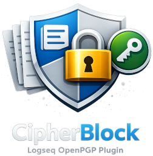

# CipherBlock – Logseq OpenPGP Plugin


<p align="center">
  
</p>

[](LICENSE)
[](https://github.com/indraginanjar/cipherblock-logseq-openpgp-plugin/releases)

A Logseq desktop plugin for OpenPGP-compatible encryption and decryption of block content directly within the editor.


## Features

- **Key Management** — Import, list, and remove OpenPGP public and private keys without leaving Logseq
- **Block Encryption** — Encrypt block content for one or more recipients using their public keys
- **Block Decryption** — Decrypt armored PGP messages using your private key
- **Vault Pages** — Encrypt content into isolated vault pages with automatic back-links
- **Output Modes** — Choose where results go: replace the block, insert as sibling, insert as sub-block, or copy to clipboard
- **Encryption Metadata** — Optionally record recipient info, timestamp, and algorithm alongside encrypted content
- **OpenPGP Compatible** — Armored output works with GnuPG 2.x, Kleopatra, and other standard PGP tools

## Installation

### From Logseq Marketplace

1. Open Logseq and go to **Plugins → Marketplace**
2. Search for "CipherBlock"
3. Click **Install**

### Build from Source

```bash
git clone https://github.com/indraginanjar/cipherblock-logseq-openpgp-plugin.git
cd cipherblock-logseq-openpgp-plugin
npm install
npm run build
```

### Load in Logseq

1. Open Logseq and go to **Settings → Advanced → Developer mode** (enable it)
2. Click **Plugins → Load unpacked plugin**
3. Select the `logseq-cipherblock` project folder
4. The plugin icon 🔐 appears in the toolbar when loaded

## Why Do I Need to Import My Keys?

> **TL;DR** — Logseq plugins run inside a sandboxed iframe and cannot access your filesystem. CipherBlock cannot read `~/.gnupg/`, your GPG agent, or any system keyring. You must import your keys into the plugin once.

### The Sandbox Explained

Logseq loads every plugin inside an isolated `<iframe>` with no direct access to the host operating system. This is a security feature — it prevents plugins from reading arbitrary files, running shell commands, or accessing other applications.

What this means for CipherBlock:

| What CipherBlock **can** do | What CipherBlock **cannot** do |
|---|---|
| Read/write data through the Logseq Plugin API | Access `~/.gnupg/` or any filesystem path |
| Show dialogs in the Logseq UI | Call `gpg` or `gpg-agent` |
| Store imported keys in Logseq's plugin storage | Read your system keyring (GNOME Keyring, macOS Keychain, etc.) |
| Encrypt/decrypt using OpenPGP.js in the browser | Use native GnuPG libraries |

### How to Import Your Existing GPG Keys

You only need to do this once. After importing, your keys are stored persistently in Logseq's plugin storage.

#### Step 1 — Export your key to a file

Open a terminal and run:

```bash
# Export your public key
gpg --armor --export your@email.com > ~/my-public-key.asc

# Export your private key (if you need to decrypt inside Logseq)
gpg --armor --export-secret-keys your@email.com > ~/my-private-key.asc
```

> ⚠️ **Keep your private key file safe.** Delete it after importing into CipherBlock, or store it in a secure location. Never commit it to version control.

#### Step 2 — Import into CipherBlock

**Option A — File picker (recommended)**

1. In any Logseq block, type `/Import Key`
2. Click **Choose File** and select your `.asc` file
3. Click **Import**

**Option B — Paste**

1. Copy the contents of your `.asc` file (including the `-----BEGIN PGP ...-----` headers)
2. Type `/Import Key`
3. Paste into the text area
4. Click **Import**

#### Step 3 — Verify

Type `/Manage Keys` to see your imported keys listed with their fingerprint, user ID, and type (public/private).

### Compatibility with GnuPG

CipherBlock uses [OpenPGP.js](https://openpgpjs.org/) (v5) which implements the OpenPGP standard (RFC 4880). Encrypted output is fully compatible with:

- **GnuPG 2.x** (`gpg --decrypt`)
- **Kleopatra** (KDE)
- **GPG Suite** (macOS)
- **OpenKeychain** (Android)
- Any tool that supports armored PGP messages

You can encrypt in CipherBlock and decrypt with `gpg` on the command line, or vice versa.

### FAQ

**Q: Do I need to re-import keys after restarting Logseq?**
No. Keys are stored persistently in Logseq's plugin file storage. They survive restarts.

**Q: Is my private key safe inside the plugin?**
Keys are stored in Logseq's plugin storage directory on your local disk (inside `.logseq/`). They are not uploaded anywhere. If your private key has a passphrase, CipherBlock will prompt for it each time you decrypt (unless you enable session caching in settings).

**Q: Can I use keys generated by GnuPG?**
Yes. Export them in armored format (`--armor`) and import the `.asc` file. RSA, ECC (Curve25519/Ed25519), and other standard key types are supported.

**Q: What if I have multiple keys?**
Import as many as you need. When encrypting, you select which recipients to encrypt for. When decrypting, CipherBlock uses your default key or prompts you to choose.

## Usage

### Slash Commands

Type `/` in any block and search for the command name. The emoji prefixes appear in the menu automatically — you don't need to type them.

| Command | Description |
|---|---|
| `/Import Key` | Import a public or private key from file or paste |
| `/Manage Keys` | View and remove imported keys |
| `/Encrypt Block` | Encrypt the current block for selected recipients |
| `/Decrypt Block` | Decrypt an armored PGP message in the current block |
| `/Encrypt to Vault` | Encrypt to a dedicated vault page |

### Block Context Menu

Right-click any block dot to access:
- **Encrypt Block**
- **Decrypt Block**
- **Encrypt to Vault**

### Encrypt a Block

1. Place your cursor in the block you want to encrypt
2. Type `/Encrypt Block` or right-click and select **Encrypt Block**
3. Select one or more recipient public keys
4. Optionally override the output mode
5. The block content is replaced with (or accompanied by) the armored PGP message

### Decrypt a Block

1. Place your cursor in a block containing an armored PGP message
2. Type `/Decrypt Block` or right-click and select **Decrypt Block**
3. The plugin uses your default private key (or prompts you to select one)
4. Enter your passphrase if the key is protected
5. The decrypted plaintext is placed according to your output mode setting

### Encrypt to Vault

1. Place your cursor in the block you want to encrypt
2. Type `/Encrypt to Vault` or right-click and select **Encrypt to Vault**
3. Select recipient public keys
4. A new vault page is created with the encrypted content, and the original block is replaced with a link to the vault page

## Configuration

Access settings via **Logseq → Plugins → CipherBlock → Settings**.

| Option | Type | Default | Description |
|---|---|---|---|
| `defaultKeyFingerprint` | string | `""` | Fingerprint of the private key used for decryption by default |
| `outputMode` | enum | `replace` | Where to place results: `replace`, `sibling`, `sub-block`, or `clipboard` |
| `passphraseCachingEnabled` | boolean | `false` | Cache passphrase in memory for the current session |
| `metadataEnabled` | boolean | `false` | Record recipient info, timestamp, and algorithm alongside encrypted content |
| `metadataMode` | enum | `attributes` | How metadata is written: `attributes` (block properties) or `sub-blocks` (child blocks) |

## Security Considerations

- CipherBlock is not audited by a third-party security firm. Use at your own risk for sensitive data.
- Keys are stored in Logseq's plugin storage directory on your local disk (inside `.logseq/plugins/`). They are not uploaded anywhere.
- Passphrase-protected private keys are never decrypted at rest — the passphrase is requested each time (unless session caching is enabled).
- Session passphrase caching stores the passphrase in memory only. It is cleared when Logseq is closed.
- OpenPGP.js runs entirely in the browser sandbox. No data leaves your machine.
- The plugin loads OpenPGP.js from a CDN (`unpkg.com`) on first use. If you require fully offline operation, consider bundling the library locally.

## Known Limitations

- Desktop only — Logseq mobile does not support plugins.
- No GPG agent integration — the plugin cannot use your system keyring or `gpg-agent` for passphrase caching.
- No key generation — you must generate keys externally (e.g. with GnuPG) and import them.
- No signature support — CipherBlock encrypts and decrypts but does not sign or verify messages.
- Large blocks may be slow to encrypt/decrypt depending on key size and browser performance.

## Contributing

See [CONTRIBUTING.md](CONTRIBUTING.md) for guidelines on how to contribute to this project.

## Changelog

See [CHANGELOG.md](CHANGELOG.md) for a list of changes in each release.

## License

This project is licensed under the [MIT License](LICENSE).
